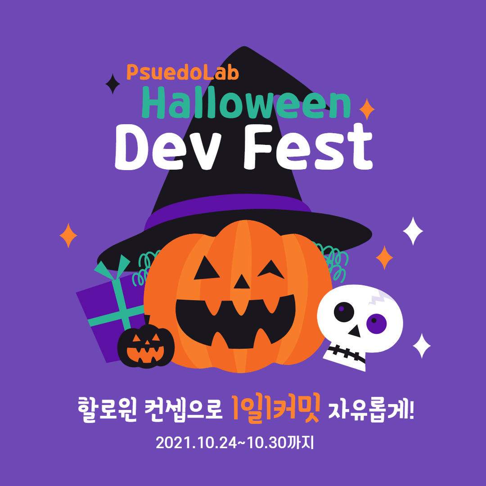

# PseudoLab Halloween Dev Fest
할로윈을 맞이하여 가짜연구소에서 할로윈 개발 축제를 엽니다!!! 일주일간 할로윈을 컨셉으로 1일1커밋하는 것으로 참가하실 수 있습니다! 참가하신 내용을 바탕으로 하나의 깃헙 리포지토리를 형성하게 되며, 가장 활발하게 그리고 기발하게 커밋하신 분들에게 소정의 상품을 드리도록 하겠습니다! 그럼 모두 happy halloween!

<p align="center">
  
</p>

## 참가 방법
- 가짜연구소 github의 halloween-devfest 리포지토리에 커밋!
- 2021 폴더 안에 각자 개인 폴더를 만들어서 커밋!
- 아래의 예시를 참고하여 할로윈과 관계된 커밋/코드리뷰 등을 수행
  - 예1) 변수/함수명을 halloween 과 관련되게 네이밍
  - 예2) halloween과 관련된 함수 개발
      ```python
      import random

      # Returns Trick or Treat
      def trcik_or_treat():
          if random.random() < .5:
              return 'trick'
          return 'treat'
      ```
  - 예3) halloween과 관련된 데이터 수집 및 분석
  - 예4) halloween 이미지 분석
  - 예5) [makemeazombie](https://makemeazombie.com/) w/StyleGAN2
※ 누구가 참여가 가능합니다!

## 일정
- Contribute  : 2021.10.24(일)-31(일)
- After Party : 2021.10.30(토) 저녁 8시

## Q&A
- Q: gitflow를 지켜야할까요? <br/>
  A: 그러면 유령들이 무서워할 것 같아요.
- Q: Rule을 지키지 않으면 어떻게 되나요? <br/>
  A: Trick or treat!
- Q: 저는 아싸인데 참여해도 될까요? <br/>
  A: 저도 아싸입니다! :)
- Q: 궁금한 점이 생겼습니다! 어디에 물어보면 될까요? <br/>
  A: github issues를 활용해주시고, [가짜연구소 슬랙 질문 게시판](https://join.slack.com/t/pseudolab/shared_invite/zt-w3v4td04-_MQz7JrdvG9qjpOYmFIzbA)을 이용해주세요!

## Contributor
- TBD

## After Party
- 코드를 간단하게 나누며, 네트워킹 파티!
- 세부 사항은 TBD

## Comments
- TBD
